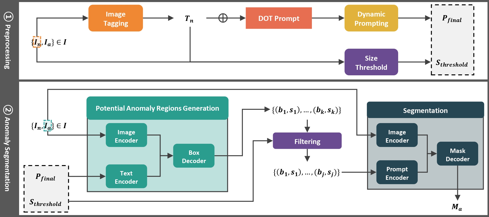

# DOT Prompt: Dynamic Object-Aware Tagging Prompt for Texture Zero-Shot Anomlay Segmentation
Zero-Shot Anomaly Segmentation by DOT Prompt, a model designed to detect anomalies in images, precisely identify their locations, and restore abnormal images to normal using LLM prompting and zero-shot segmentation techniques. 


## Requirements & Setup
This codebase utilizes Anaconda for managing environmental dependencies. Please follow these steps to set up the environment:
1. **Download Anaconda:** [Click here](https://www.anaconda.com/download) to download Anaconda.
2. **Clone the Repository:**
Clone the repository using the following command.
   ```bash
   git clone https://github.com/sybeam27/DOT-Prompt
   ```
3. **Install Requirements:**
   - Navigate to the cloned repository:
     ```bash
     cd DOT-ZSAS
     ```
   - Create a Conda environment from the provided `environment.yaml` file:
     ```bash
     conda env create -f environment.yaml
     ```
   - Activate the Conda environment:
     ```bash
     conda activate dot_zsas
     ```
This will set up the environment required to run the codebase.

## Datasets
Below are the details and download links for datasets used in our experiments:
1. **MVTec-AD** [(Download)](https://www.mvtec.com/downloads): The MVTec AD dataset comprises approximately 5,000 images across 15 classes, including texture-related categories such as fabric and wood.
2. **KSDD1** [(Download)](https://www.vicos.si/resources/kolektorsdd/): The KSDD1 dataset includes 347 normal images and 52 abnormal images, specifically for detecting micro-defects on metal surfaces.
3. **MTD** [(Download)](https://github.com/abin24/Magnetic-tile-defect-datasets.): The MTD dataset contains images of magnetic tiles, featuring various types of defects.
These datasets provide valuable resources for our experiments and each known for their high-resolution, texture-rich images that are well-suited for texture anomaly segmentation.

## Zero-Shot Anomaly Segmentation (ZSAS) TEST
Replace `<dataset>` with one of the following options: `mvtec`, `ksdd`, `mtd`.

Replace `<model>` with one of the following options: `base`, `dot_zsas`.

```python
python test_zsas.py --dataset <dataset name> --model <model name> 
```
This command excel our proposed model for zero-shot anomaly segmentation(ZSAS) on the specified dataset using the selected model, with best configurations loaded, running 10 epochs each.

## Ablation Study TEST
Ablatin study on MVTec-AD texture dataset.
```python
python test_ablation.py --image True --prompt True --filter True 
```

#### Optional arguments
```
  --gpu                             gpu number
  --dataset                         dataset name
  --model                           model name
  --box_threshold                   GroundingSAM box threshold
  --text_threshold                  GroundingSAM text threshold
  --size_threshold                  Bounding-box size threshold
  --iou_threshold                   IoU threshold
  --random_img_num                  random image extraction number
  --eval_resolution                 Description of evaluation resolution
  --exp_idx                         Description of experiment index
  --version                         Description of evaluation version
```

## Special Thanks to
We extend our gratitude to the authors of the following libraries for generously sharing their source code and dataset:

[RAM](https://github.com/xinyu1205/recognize-anything),
[Llama3](https://github.com/meta-llama/llama3),
[Grounding DINO](https://github.com/IDEA-Research/GroundingDINO),
[SAM](https://github.com/facebookresearch/segment-anything),
[SAA+](https://github.com/caoyunkang/Segment-Any-Anomaly?tab=readme-ov-file)
Your contributions are greatly appreciated.

## Citation
